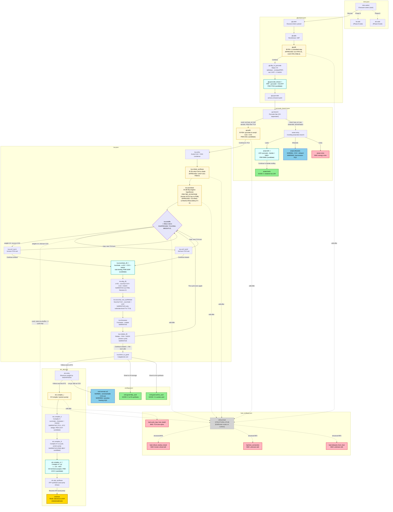

# Phase 5.1 — Glucose Story Graph Diagram

A visual summary of the 43-node glucose skeleton (`data/story_glucose/`) for human
review (Plan 05.1-06). Color-coded by ending tier; edit-allowed nodes marked with
a gear icon; the RNG shuffle is a diamond; structural (non-runtime) edges are dashed.
The 4 FULL nodes with PDB loads added in the tiered-completeness expansion
(`gly.pyruvate_kinase`, `anaer.ldh`, `tca.isocitrate_dh`, `etc.complex_iv`) are
marked with 🧬; the 6 NARRATIVE-only nodes added in the expansion
(`tca.akg_dh`, `tca.succinyl_coa_synthetase`, `tca.fumarase`, `tca.malate_dh`,
`etc.complex_ii`, `etc.complex_iii`) are plain boxes.

**Legend:**

| Style | Meaning |
|-------|---------|
| Solid arrow `-->` | Player-traversed `choice.goto` edge (BFS-reachable) |
| Dashed arrow `-.->` | Structural-only edge (BFS-reachable, not player-facing at runtime) |
| Gold rounded box | True ending |
| Green rounded box | Good ending |
| Blue rounded box | Normal ending |
| Red rounded box | Bad ending |
| Cream box with ⚙️ | Edit-allowed node (`edit:enzyme:<id>` tag — player can trigger an edit) |
| Box with 🧬 | FULL node with a PDB load in `on_enter` (CANDIDATE/PENDING Phase 7 approval) |
| Purple diamond with 🎲 | RNG-shuffle node (weighted choice — the RNG decides, not the player) |
| Grey dashed box | Structural stub (`edit.prompt` — runtime routing bypasses it) |

---

## Full Graph Topology

---

## Branch-Point Mapping (SC1 human-review)

Each real player-facing branch point in the graph, the pathway fact it maps to, and
the claim status. **No invented branches** — every branch traces to spec.md, an
approved source, or a flagged `PLACEHOLDER_PHASE7` node (Phase 7 fills citations).
The tiered-completeness expansion added path nodes but NO new branch points — the
6 MC-choice branch nodes below are unchanged.

| # | Branch node | Player options | Pathway branch point mapped to | Claim status |
|---|-------------|----------------|-------------------------------|--------------|
| 1 | `intro.select` | Glucose / FA / Alcohol | Character selection (spec.md L19 — meta-game, not a pathway branch) | PLACEHOLDER_PHASE7 |
| 2 | `pyr.branch` | Aerobic (PDH→TCA) / Anaerobic (fermentation) | **Pyruvate fate depends on O2** — aerobic: pyruvate→acetyl-CoA via PDH; anaerobic: pyruvate→lactate/ethanol (spec.md L14, option d) | PLACEHOLDER_PHASE7_ANAEROBIC |
| 3 | `anaer.entry` | Lactic (→LDH step→lactic) / Ethanolic / Crisis | **3-ending anaerobic branch** — lactic=Good (C retained via LDH, now a playable LDH step), ethanolic=Normal (CO2), crisis=Bad (energy failure) (PROJECT.md row 97) | PLACEHOLDER_PHASE7_ANAEROBIC |
| 4 | `tca.shuffle` | 1st-turn CO2 (w=0.5) / 2nd-turn CO2 (w=0.5) / edit / cycle-trap | **Citrate prochirality RNG shuffle** — the Ogston hypothesis: aconitase discriminates citrate's two carboxymethyl groups (spec.md L13) | **APPROVED: TCA-RNG-WEIGHT-01, TCA-RNG-CITRATE-PROCHIRALITY-01** |
| 5 | `tca.divert_to_good` | Follow soul (ETC) / FA storage / AA synthesis | **Cataplerotic exit** — citrate→cytosol→FA synthesis; OAA→aspartate; aKG→glutamate (carbon diverted pre-oxidation = Good) | PLACEHOLDER_PHASE7_TCA |
| 6 | `etc.entry` | Follow soul (ETC) / Let go (CO2) | **ETC entry vs CO2 exit** — the narrative "let go" branch point (Normal-ending tier) | PLACEHOLDER_PHASE7_ETC |
| 7 | `tca.malate_dh` *(NEW, NARRATIVE)* | The cycle turns again (→shuffle) / Continue onward (→divert_to_good) | **TCA loop vs exit** — malate DH regenerates OAA, closing the cycle (loop) OR the player exits to the cataplerotic branch (forward). NOT a tier-determining branch (both paths keep the carbon in the TCA-or-exit flow); SC5 class "neither". | PLACEHOLDER_PHASE7_TCA |
| 8 | `edit.prompt` (stub) | critical-residue / unknown-A / unknown-B | *(structural stub — NOT a real pathway branch; the EditRouter owns the real edit routing)* | PLACEHOLDER_PHASE7_EDIT |

---

## Ending-Tier Distribution (11 endings — UNCHANGED by the expansion)

| Tier | Count | Nodes |
|------|-------|-------|
| True | 1 | `end.true` (electrons→ATP via ETC, metamorphosis) |
| Good | 3 | `anaer.lactic`, `end.good.fatty_acid`, `end.good.amino_acid` |
| Normal | 2 | `anaer.ethanolic`, `end.normal.co2` |
| Bad | 5 | `anaer.crisis`, `bad.lost_connection`, `bad.released_from_host`, `bad.cycle_trap_host_death`, `bad.critical_residue_break` |

Matches PROJECT.md row 107 (user-confirmed asymmetric distribution). The
tiered-completeness expansion added 9 path nodes but ZERO new endings — the
distribution is unchanged.

---

## Edit-Allowed Nodes (SC4 — 5 nodes + the shuffle; UNCHANGED by the expansion)

Each carries an `edit:enzyme:<id>` tag binding it to an EditRouter lookup bucket.
The player's edit generates an `EditIntent`; `EditRouter.route(intent, enzyme_id)`
returns a node-id (known→branch node, unknown→bad-ending pool). **The expansion
added NO new edit-allowed nodes** — the 5 existing + `tca.shuffle` stay the only
edit-allowed nodes. The 9 new nodes are all "neither" (forced-advance narrative
or PDB-load nodes, not edit-allowed).

| Node | enzyme_id | Real enzyme + PDB | Claim status |
|------|-----------|-------------------|--------------|
| `gly.pfk` | `gly.pfk` | PFK-1; PDB 4PFK | **APPROVED: GLY-PFK-01, CAST-PFK-PDB-01** |
| `pyr.pdh` | `pyr.pdh` | PDH complex; PDB 2OZL (candidate, NEW load) | PLACEHOLDER_PHASE7 |
| `tca.citrate_synthase` | `tca.citrate_synthase` | Citrate synthase; PDB 1CSC | **APPROVED: CAST-CSC-PDB-01, TCA-RNG-CITRATE-PROCHIRALITY-01** |
| `tca.aconitase` | `tca.aconitase` | Aconitase; PDB TBD_ACONITASE (NEW load; human ACO2 has no PDB, bovine 1ACO is a candidate) | **APPROVED: TCA-RNG-CITRATE-PROCHIRALITY-01** |
| `tca.shuffle` | `tca.aconitase` | Aconitase (same bucket — the shuffle's edit:offer edits aconitase) | **APPROVED: TCA-RNG-WEIGHT-01, TCA-RNG-CITRATE-PROCHIRALITY-01** |
| `etc.complex_i` | `etc.complex_i` | Complex I; PDB 5LDW (candidate, not yet loaded) | PLACEHOLDER_PHASE7_ETC |

---

## New Nodes Added in the Tiered-Completeness Expansion (9 net nodes)

| Node | Type | PDB load | Decision | Rationale |
|------|------|----------|----------|-----------|
| `gly.pyruvate_kinase` | FULL | pdb:7FS3 (candidate) | 1+3 | Split PK out of the compressed `gly.fbp_to_pyruvate`; PEP→pyruvate + 2nd substrate-level ATP is exam-worthy |
| `anaer.ldh` | FULL | pdb:5W8J (candidate) | 4 | Lactic fermentation is exam-worthy; LDH playable step before the lactic ending |
| `tca.isocitrate_dh` | FULL | pdb:5GRF (candidate) | 1 | Rate-limiting TCA step, 1st CO2 release |
| `tca.akg_dh` | NARRATIVE | (none) | 2 | α-KG DH narrative-only (no PDB); 2nd CO2 release, homologous to PDH |
| `tca.succinyl_coa_synthetase` | NARRATIVE | (none) | 1 | Only substrate-level phosphorylation in TCA (GTP) |
| `tca.fumarase` | NARRATIVE | (none) | 1 | Fumarate→malate |
| `tca.malate_dh` | NARRATIVE | (none) | 1 | Malate→OAA + NADH (regenerates OAA, closes the cycle); 2 choices (loop/forward) but not tier-determining |
| `etc.complex_ii` | NARRATIVE | (none) | 3 | Complex II = succinate DH = TCA step 6, the TCA↔ETC bridge |
| `etc.complex_iii` | NARRATIVE | (none) | 3 | Q-cycle (ubiquinol→cytochrome c, proton pump) |
| `etc.complex_iv` | FULL | pdb:1OCC (candidate) | 3 | Cyt c oxidase — O2 terminal acceptor; grounds the aerobic-only True ending |

**Removed:** `etc.complex_ii_iii_iv` (the compressed Complex II+III+IV node,
replaced by the 3 split nodes above).

**PDB candidates pending Phase 7 human approval (6):** 7FS3 (pyruvate kinase),
2OZL (PDH), 5W8J (LDH), 5GRF (isocitrate DH IDH3A), 1OCC (Complex IV),
TBD_ACONITASE (aconitase — human mito ACO2 has no PDB; bovine 1ACO at 2.05 Å
is the classic Ogston-hypothesis teaching structure, candidate for Phase 7
review). NONE of these are in `data/citations.json` / `data/sources.json` —
they are a separate Phase 7 approval batch. All new nodes use
`PLACEHOLDER_PHASE7*` claim_ids.

---

## Key Design Decisions Locked (do not re-litigate)

- **Soul-jump True ending** (metamorphosis): hero's electrons→ATP via ETC; carbon body shed as CO2. NOT "carbon becomes ATP."
- **C14-decay DROPPED**: `bad.cycle_trap_host_death` is the SOLE timescale bad-ending (no radioactive decay).
- **Anaerobic = option (d)**: glucose gets 3-ending branch; FA/alcohol get Bad-trigger only. Host = mammal.
- **TCA RNG 0.5/0.5**: approved weights for 1st-turn vs 2nd-turn CO2 exit. SOLE stochastic node — the 5 new TCA enzyme nodes are DOWNSTREAM of the shuffle (they embody its outcome, not new RNG).
- **Edit routing**: lookup table + bad-ending fallback (no chemistry-correctness engine).
- **Tiered completeness (Decisions 1-5, NEW in EXPANSION)**: FULL nodes with PDB loads for HIGH-priority teaching points + NARRATIVE-only nodes to complete the cycle visibly. α-KG DH = narrative-only (Decision 2). Complex II+III+IV split into separate nodes, Complex IV also split out (Decision 3). LDH playable step before the lactic ending (Decision 4). Aconitase PDB load added now (Decision 5, TBD placeholder — human ACO2 has no PDB).
