# Phase 5.1 — Glucose Story Graph Diagram

A visual summary of the 54-node glucose skeleton (`data/story_glucose/`) for human
review (Plan 05.1-06). Color-coded by ending tier; edit-allowed nodes marked with
a gear icon; the RNG shuffle is a diamond; structural (non-runtime) edges are dashed.
The 4 FULL nodes with PDB loads added in the tiered-completeness expansion
(`gly.pyruvate_kinase`, `anaer.ldh`, `tca.isocitrate_dh`, `etc.complex_iv`) are
marked with 🧬; the 6 NARRATIVE-only nodes added in the expansion
(`tca.akg_dh`, `tca.succinyl_coa_synthetase`, `tca.fumarase`, `tca.malate_dh`,
`etc.complex_ii`, `etc.complex_iii`) are plain boxes.

**Post-replan state (Plans 05.1-07/08/09):** 43 nodes UNCHANGED count; **14
edit-allowed nodes** (8 disease-mutant promotions grew the set from 5+shuffle to
14); **0 single-Continue nodes** (15 Continue-to-MC conversions added an
`mc:observe` Observe second choice to every formerly single-Continue node); 8
disease-mutant promotions (`DIS-*-cand` CANDIDATE claim_ids, pending Phase 7
per-claim approval); the `pyr.pdh` 2OZL→6CFO cast-PDB fix; the
`etc.complex_i` PLACEHOLDER→`DIS-NDUFS8-01-cand` claim_id fix; the
`tca.citrate_synthase` `edit:structural` reframe. See the
[Disease-Mutant Replan Changes](#disease-mutant-replan-changes) section below.

**Post-expansion state (Plans 05.1-12/13):** 54 nodes (was 43); 20 endings (was
11; 1T+3G+2N+14B — the Bad tier grew 5 → 14); start node `intro.preface` (was
`intro.select`); +9 bad-ending nodes (Req 1: 6 1a unknown-pool + 3 1b
known-consequence) + 2 preface nodes (Req 2: `intro.preface` Beat A +
`intro.shell_glucose` Beat B). The 14 edit-allowed count + the 0 single-Continue
invariant are UNCHANGED. See the
[Bad-Ending + Preface Expansion](#bad-ending--preface-expansion-plans-0511213)
section below.

**Legend:**

| Style | Meaning |
|-------|---------|
| Solid arrow `-->` | Player-traversed `choice.goto` edge (BFS-reachable) |
| Dashed arrow `-.->` | Structural-only edge (BFS-reachable, not player-facing at runtime) |
| Gold rounded box | True ending |
| Green rounded box | Good ending |
| Blue rounded box | Normal ending |
| Red rounded box | Bad ending |
| Cream box with ⚙️ | Edit-allowed node (`edit:enzyme:<id>` tag — player can trigger an edit) |
| Box with 🧬 | FULL node with a PDB load in `on_enter` (CANDIDATE/PENDING Phase 7 approval) |
| Purple diamond with 🎲 | RNG-shuffle node (weighted choice — the RNG decides, not the player) |
| Grey dashed box | Structural stub (`edit.prompt` — runtime routing bypasses it) |

> **Preface nodes (NEW in Plans 05.1-12/13):** `intro.preface` + `intro.shell_glucose`
> are plain boxes (same style as other choice nodes) with a PDB-load corner mark
> (🧬) — the renderer does NOT introduce a distinct preface style. They each carry
> a Continue + an `mc:observe` Observe 2nd choice (the 0-single-Continue invariant
> is UNCHANGED).

---

## Full Graph Topology

```mermaid
graph TD
    %% ===== INTRO =====
    subgraph intro["intro.json"]
        IP["intro.preface<br/>Beat A — the hero's blessing (start)"]
        IS["intro.select<br/>Character-select"]
        ISG["intro.shell_glucose<br/>Beat B — the hero dons glucose"]
        FA["fa.stub<br/>(Phase 8 stub)"]
        AL["alc.stub<br/>(Phase 8 stub)"]
    end

    %% ===== GLYCOLYSIS =====
    subgraph gly["glycolysis.json"]
        GS["gly.start<br/>Glucose enters cytosol"]
        GG["gly.g6p<br/>Hexokinase: G6P"]
        GP["gly.pfk<br/>⚙️ PFK-1 committed step<br/>APPROVED: GLY-PFK-01, CAST-PFK-PDB-01<br/>DIS-PFKM-01-cand (G209D, Tarui)"]
        GF["gly.fbp_to_pyruvate<br/>Steps 4-9 (aldolase→enolase/PEP)<br/>net 2 ATP + 2 NADH"]
        GPK["gly.pyruvate_kinase ⚙️ 🧬<br/>PEP→pyruvate + 2nd ATP<br/>PDB 7FS3 (candidate)<br/>DIS-PKLR-01-cand (R479H, CNSHA2)"]
        GY["gly.pyruvate<br/>arrives at branch point"]
    end

    %% ===== PYRUVATE BRANCH =====
    subgraph pyr["pyruvate_branch.json"]
        PB["pyr.branch<br/>Pyruvate fate (O2-dependent)"]
        PP["pyr.pdh<br/>⚙️ PDH: pyruvate to acetyl-CoA + CO2<br/>PDB 6CFO (WT candidate, was 2OZL phospho-mimic)<br/>DIS-PDHA1-01-cand (V138M) + CAST-PDH-WT-PDB-01-cand"]
        AE["anaer.entry<br/>3-ending anaerobic branch"]
        ALD["anaer.ldh 🧬<br/>LDH: pyruvate→lactate + NAD+<br/>PDB 5W8J (candidate)"]
        ALA["anaer.lactic<br/>GOOD: C retained via LDH"]
        AET["anaer.ethanolic<br/>NORMAL: CO2 + ethanol<br/>WARNING: host-tension OQ1"]
        ACR["anaer.crisis<br/>BAD: energy crisis"]
    end

    %% ===== TCA =====
    subgraph tca["tca.json"]
        TE["tca.entry<br/>Acetyl-CoA + OAA condense"]
        TC["tca.citrate_synthase<br/>⚙️ edit:structural (NO disease point mutant)<br/>(S)-citryl-CoA to citrate<br/>APPROVED: CAST-CSC-PDB-01"]
        TA["tca.aconitase<br/>⚙️ 180 flip (Ogston hypothesis)<br/>PDB TBD_ACONITASE (human ACO2 has no PDB)<br/>APPROVED: TCA-RNG-CITRATE-PROCHIRALITY-01<br/>DIS-ACO2-01-cand (S112R, ICRD)"]
        TS{"tca.shuffle<br/>🎲 RNG 0.5/0.5<br/>⚙️ APPROVED: TCA-RNG-WEIGHT-01"}
        T1["tca.co2_turn1<br/>1st-turn CO2 exit"]
        T2["tca.co2_turn2<br/>2nd-turn CO2 exit"]
        TIDH["tca.isocitrate_dh ⚙️ 🧬<br/>Isocitrate→α-KG + CO2 + NADH<br/>rate-limiting; PDB 5GRF (candidate)<br/>DIS-IDH3A-01-cand (M204I, RP90)"]
        TAKG["tca.akg_dh<br/>α-KG→succinyl-CoA + CO2 + NADH<br/>NARRATIVE (no PDB, Decision 2)"]
        TSCS["tca.succinyl_coa_synthetase ⚙️<br/>Succinyl-CoA→succinate + GTP<br/>NARRATIVE (only substrate-level P in TCA)<br/>DIS-SUCLG1-01-cand (G85A, MTDPS9)"]
        TFUM["tca.fumarase ⚙️<br/>Fumarate→malate<br/>NARRATIVE<br/>DIS-FH-01-cand (R233H, HLRCC)"]
        TMAL["tca.malate_dh ⚙️<br/>Malate→OAA + NADH (closes cycle)<br/>NARRATIVE<br/>DIS-MDH2-01-cand (G37R, DEE51)"]
        TD["tca.divert_to_good<br/>Cataplerotic exit"]
    end

    %% ===== ETC =====
    subgraph etc["etc_atp.json"]
        EE["etc.entry<br/>Electrons caught by NADH/FADH2"]
        EC1["etc.complex_i<br/>⚙️ Complex I (proton pump)<br/>DIS-NDUFS8-01-cand (Loeffen 1998, Leigh)"]
        EC2["etc.complex_ii ⚙️<br/>Complex II: succinate→fumarate + FADH2<br/>NARRATIVE (TCA↔ETC bridge; PDB 1ZOY candidate)<br/>DIS-SDHA-01-cand (W512R, Bourgeron 1995)"]
        EC3["etc.complex_iii ⚙️<br/>Complex III: Q-cycle, proton pump<br/>NARRATIVE (PDB 1BGY candidate)<br/>DIS-CYC1-01-cand (C12W, Gaignard 2013)"]
        EC4["etc.complex_iv ⚙️ 🧬<br/>Complex IV: cyt c→O2→H2O<br/>O2 terminal acceptor; PDB 1OCC (candidate)<br/>DIS-COX4I1-01-cand (T130P, Pillai 2019)"]
        EATP["etc.atp_synthase<br/>ATP synthase (soul-jump climax)"]
        ET["end.true<br/>TRUE: electrons to ATP<br/>(metamorphosis)"]
    end

    %% ===== AEROBIC ENDINGS =====
    subgraph ends["endings.json"]
        EFA["end.good.fatty_acid<br/>GOOD: C to FA synthesis"]
        EAA["end.good.amino_acid<br/>GOOD: C to amino acid"]
        ENC["end.normal.co2<br/>NORMAL: unremarkable CO2 exit<br/>WARNING: narrative-framing OQ2"]
    end

    %% ===== BAD ENDINGS + EDIT STUB =====
    subgraph bad["bad_endings.json"]
        EP["edit.prompt<br/>STRUCTURAL STUB<br/>(EditRouter routes at runtime)"]
        BL["bad.lost_connection<br/>BAD: unknown edit"]
        BR["bad.released_from_host<br/>BAD: unknown edit"]
        BC["bad.cycle_trap_host_death<br/>BAD: TCA over-spins"]
        BK["bad.critical_residue_break<br/>BAD: known critical edit"]
        BEC["bad.enzyme_collapse<br/>BAD: 1a unknown pool"]
        BST["bad.wrong_substrate_trapped<br/>BAD: 1a unknown pool"]
        BBA["bad.broken_active_site<br/>BAD: 1a unknown pool"]
        BLIC["bad.lost_in_cytosol<br/>BAD: 1a unknown pool"]
        BPL["bad.proton_leak<br/>BAD: 1a unknown pool"]
        BMA["bad.misfolded_aggregate<br/>BAD: 1a unknown pool"]
        BAS["bad.active_site_destroyed<br/>BAD: 1b known consequence"]
        BSC["bad.substrate_channel_blocked<br/>BAD: 1b known consequence"]
        BCL["bad.cofactor_lost<br/>BAD: 1b known consequence"]
    end

    %% ===== MAIN FLOW =====
    IP -->|"Continue"| IS
    IS -->|"Glucose"| ISG
    ISG -->|"Begin journey"| GS
    IS -.->|"Phase 8"| FA
    IS -.->|"Phase 8"| AL

    GS -->|"Continue"| GG
    GS -->|"Observe (mc:observe)"| GG
    GG -->|"Continue"| GP
    GG -->|"Observe (mc:observe)"| GP
    GP -->|"Continue glycolysis"| GF
    GF -->|"Continue"| GPK
    GF -->|"Observe (mc:observe)"| GPK
    GPK -->|"Continue"| GY
    GPK -->|"Observe (mc:observe)"| GY
    GY -->|"Continue"| PB
    GY -->|"Observe (mc:observe)"| PB

    %% ===== PYRUVATE BRANCH POINT =====
    PB -->|"cond: not host_o2_low<br/>aerobic: PDH then TCA"| PP
    PB -->|"cond: host_o2_low<br/>anaerobic: fermentation"| AE
    AE -->|"Lactic"| ALD
    ALD -->|"Continue to lactate ending"| ALA
    ALD -->|"Observe (mc:observe)"| ALA
    AE -->|"Ethanolic"| AET
    AE -->|"Crisis"| ACR
    PP -->|"Continue to TCA"| TE

    %% ===== TCA CYCLE + RNG SHUFFLE =====
    TE -->|"Continue"| TC
    TE -->|"Observe (mc:observe)"| TC
    TC --> TA --> TS
    TS -->|"weight 0.5: 1st-turn CO2"| T1
    TS -->|"weight 0.5: 2nd-turn CO2"| T2
    T1 -->|"loop: next TCA turn"| TS
    T2 -->|"loop: next TCA turn"| TS
    T1 -->|"Continue onward"| TIDH
    T2 -->|"Continue onward"| TIDH
    TIDH -->|"Continue"| TAKG
    TIDH -->|"Observe (mc:observe)"| TAKG
    TAKG -->|"Continue"| TSCS
    TAKG -->|"Observe (mc:observe)"| TSCS
    TSCS -->|"Continue"| TFUM
    TSCS -->|"Observe (mc:observe)"| TFUM
    TFUM -->|"Continue"| TMAL
    TFUM -->|"Observe (mc:observe)"| TMAL
    TMAL -->|"The cycle turns again"| TS
    TMAL -->|"Continue onward — the soul calls"| TD
    TS -.->|"cond: visits tca.shuffle > 5<br/>cycle-trap"| BC
    TD -->|"Follow soul to ETC"| EE
    TD -->|"Divert to FA storage"| EFA
    TD -->|"Divert to AA synthesis"| EAA

    %% ===== ETC + TRUE ENDING =====
    EE -->|"Follow soul into ETC"| EC1
    EE -->|"Let go: drift as CO2"| ENC
    EC1 -->|"Continue down the chain"| EC2
    EC2 -->|"Continue"| EC3
    EC2 -->|"Observe (mc:observe)"| EC3
    EC3 -->|"Continue"| EC4
    EC3 -->|"Observe (mc:observe)"| EC4
    EC4 -->|"Continue to ATP synthase"| EATP
    EC4 -->|"Observe (mc:observe)"| EATP
    EATP -->|"Become ATP (soul-jump)"| ET
    EATP -->|"Observe (mc:observe)"| ET

    %% ===== EDIT EDGES (structural — dashed) =====
    GP -.->|"edit:offer"| EP
    PP -.->|"edit:offer"| EP
    TC -.->|"edit:offer"| EP
    TA -.->|"edit:offer"| EP
    TS -.->|"edit:offer"| EP
    EC1 -.->|"edit:offer"| EP
    GPK -.->|"edit:offer"| EP
    TIDH -.->|"edit:offer"| EP
    TSCS -.->|"edit:offer"| EP
    TFUM -.->|"edit:offer"| EP
    TMAL -.->|"edit:offer"| EP
    EC2 -.->|"edit:offer"| EP
    EC3 -.->|"edit:offer"| EP
    EC4 -.->|"edit:offer"| EP
    EP -.->|"structural BFS"| BK
    EP -.->|"structural BFS"| BL
    EP -.->|"structural BFS"| BR
    EP -.->|"structural"| BEC
    EP -.->|"structural"| BST
    EP -.->|"structural"| BBA
    EP -.->|"structural"| BLIC
    EP -.->|"structural"| BPL
    EP -.->|"structural"| BMA
    EP -.->|"structural"| BAS
    EP -.->|"structural"| BSC
    EP -.->|"structural"| BCL

    %% ===== STYLING =====
    classDef trueEnd fill:#FFD700,stroke:#B8860B,stroke-width:3px,color:#000
    classDef goodEnd fill:#90EE90,stroke:#228B22,stroke-width:2px,color:#000
    classDef normalEnd fill:#87CEEB,stroke:#4169E1,stroke-width:2px,color:#000
    classDef badEnd fill:#FFB6C1,stroke:#DC143C,stroke-width:2px,color:#000
    classDef editNode fill:#FFF8DC,stroke:#DAA520,stroke-width:2px,color:#000
    classDef pdbNode fill:#E0FFFF,stroke:#008B8B,stroke-width:2px,color:#000
    classDef rngNode fill:#E6E6FA,stroke:#8A2BE2,stroke-width:2px,color:#000
    classDef stubNode fill:#D3D3D3,stroke:#696969,stroke-width:1px,color:#333,stroke-dasharray: 5 5

    class ET trueEnd
    class ALA,EFA,EAA goodEnd
    class AET,ENC normalEnd
    class ACR,BL,BR,BC,BK,BEC,BST,BBA,BLIC,BPL,BMA,BAS,BSC,BCL badEnd
    class GP,PP,TC,TA,EC1,GPK,TIDH,TSCS,TFUM,TMAL,EC2,EC3,EC4 editNode
    class ALD pdbNode
    class TS rngNode
    class EP stubNode
```

---

## Branch-Point Mapping (SC1 human-review)

Each real player-facing branch point in the graph, the pathway fact it maps to, and
the claim status. **No invented branches** — every branch traces to spec.md, an
approved source, or a flagged `PLACEHOLDER_PHASE7` node (Phase 7 fills citations).
The tiered-completeness expansion added path nodes but NO new branch points — the
6 MC-choice branch nodes below are unchanged. The disease-mutant replan added
same-destination `mc:observe` Observe choices (Continue-to-MC) to 15 formerly
single-Continue nodes + `edit:offer` choices to 8 newly promoted nodes, but these
do NOT create new structural branch points (the Observe choices go to the SAME
destination as Continue; the edit:offer choices go to the `edit.prompt` stub).

| # | Branch node | Player options | Pathway branch point mapped to | Claim status |
|---|-------------|----------------|-------------------------------|--------------|
| 1 | `intro.select` | Glucose / FA / Alcohol | Character selection (spec.md L19 — meta-game, not a pathway branch) | PLACEHOLDER_PHASE7 |
| 2 | `pyr.branch` | Aerobic (PDH→TCA) / Anaerobic (fermentation) | **Pyruvate fate depends on O2** — aerobic: pyruvate→acetyl-CoA via PDH; anaerobic: pyruvate→lactate/ethanol (spec.md L14, option d) | PLACEHOLDER_PHASE7_ANAEROBIC |
| 3 | `anaer.entry` | Lactic (→LDH step→lactic) / Ethanolic / Crisis | **3-ending anaerobic branch** — lactic=Good (C retained via LDH, now a playable LDH step), ethanolic=Normal (CO2), crisis=Bad (energy failure) (PROJECT.md row 97) | PLACEHOLDER_PHASE7_ANAEROBIC |
| 4 | `tca.shuffle` | 1st-turn CO2 (w=0.5) / 2nd-turn CO2 (w=0.5) / edit / cycle-trap | **Citrate prochirality RNG shuffle** — the Ogston hypothesis: aconitase discriminates citrate's two carboxymethyl groups (spec.md L13) | **APPROVED: TCA-RNG-WEIGHT-01, TCA-RNG-CITRATE-PROCHIRALITY-01** |
| 5 | `tca.divert_to_good` | Follow soul (ETC) / FA storage / AA synthesis | **Cataplerotic exit** — citrate→cytosol→FA synthesis; OAA→aspartate; aKG→glutamate (carbon diverted pre-oxidation = Good) | PLACEHOLDER_PHASE7_TCA |
| 6 | `etc.entry` | Follow soul (ETC) / Let go (CO2) | **ETC entry vs CO2 exit** — the narrative "let go" branch point (Normal-ending tier) | PLACEHOLDER_PHASE7_ETC |
| 7 | `tca.malate_dh` *(NEW, NARRATIVE, PROMOTED)* | The cycle turns again (→shuffle) / Continue onward (→divert_to_good) / edit:offer (→edit.prompt) | **TCA loop vs exit** — malate DH regenerates OAA, closing the cycle (loop) OR the player exits to the cataplerotic branch (forward). NOT a tier-determining branch (both paths keep the carbon in the TCA-or-exit flow); SC5 class "neither". The edit:offer (3rd choice, added in replan) routes to the structural edit.prompt stub. | PLACEHOLDER_PHASE7_TCA + DIS-MDH2-01-cand |
| 8 | `edit.prompt` (stub) | critical-residue / unknown-A / unknown-B | *(structural stub — NOT a real pathway branch; the EditRouter owns the real edit routing)* | PLACEHOLDER_PHASE7_EDIT |

---

## Ending-Tier Distribution (20 endings — was 11; the Bad tier grew 5 → 14 via Plans 05.1-12/13)

| Tier | Count | Nodes |
|------|-------|-------|
| True | 1 | `end.true` (electrons→ATP via ETC, metamorphosis) |
| Good | 3 | `anaer.lactic`, `end.good.fatty_acid`, `end.good.amino_acid` |
| Normal | 2 | `anaer.ethanolic`, `end.normal.co2` |
| Bad | 14 | `anaer.crisis`, `bad.lost_connection`, `bad.released_from_host`, `bad.cycle_trap_host_death`, `bad.critical_residue_break` (existing 5) + `bad.enzyme_collapse`, `bad.wrong_substrate_trapped`, `bad.broken_active_site`, `bad.lost_in_cytosol`, `bad.proton_leak`, `bad.misfolded_aggregate` (1a, 6) + `bad.active_site_destroyed`, `bad.substrate_channel_blocked`, `bad.cofactor_lost` (1b, 3) |

Matches PROJECT.md row 107 (user-confirmed asymmetric distribution) + the
05.1-06 checkpoint feedback Req 1 (CG-collection bad endings). The Bad tier
grew 5 → 14 via Plans 05.1-12/13 (9 new bad endings: 6 1a unknown-pool + 3 1b
known-consequence); True/Good/Normal UNCHANGED.

---

## Edit-Allowed Nodes (SC4 — 14 nodes post-replan)

> **UNCHANGED by the 05.1-12/13 bad-ending + preface expansion** (no `edit:enzyme`
> tags added). The 14 nodes below are the same set as post-replan.

Each carries an `edit:enzyme:<id>` tag binding it to an EditRouter lookup bucket.
The player's edit generates an `EditIntent`; `EditRouter.route(intent, enzyme_id)`
returns a node-id (known→branch node, unknown→bad-ending pool).

The disease-mutant replan (Plans 05.1-07/08/09) **promoted 8 enzyme nodes to
edit-allowed**, growing the set from 5+shuffle to 14. The 8 promotions are marked
**[PROMOTED]** below; the original 6 gained `DIS-*-cand` claim references (or the
`edit:structural` reframe for citrate synthase).

| Node | enzyme_id | Real enzyme + PDB | Claim status |
|------|-----------|-------------------|--------------|
| `gly.pfk` | `gly.pfk` | PFK-1; PDB 4PFK | **APPROVED: GLY-PFK-01, CAST-PFK-PDB-01** + DIS-PFKM-01-cand (G209D, Tarui) |
| `pyr.pdh` | `pyr.pdh` | PDH complex; PDB **6CFO** (WT, was 2OZL phospho-mimic) | PLACEHOLDER_PHASE7 + DIS-PDHA1-01-cand (V138M) + CAST-PDH-WT-PDB-01-cand |
| `tca.citrate_synthase` | `tca.citrate_synthase` | Citrate synthase; PDB 1CSC; **edit:structural** (NO disease point mutant) | **APPROVED: CAST-CSC-PDB-01, TCA-RNG-CITRATE-PROCHIRALITY-01** |
| `tca.aconitase` | `tca.aconitase` | Aconitase; PDB TBD_ACONITASE (human ACO2 has no PDB, bovine 1ACO candidate) | **APPROVED: TCA-RNG-CITRATE-PROCHIRALITY-01** + DIS-ACO2-01-cand (S112R, ICRD) |
| `tca.shuffle` | `tca.aconitase` | Aconitase (same bucket — the shuffle's edit:offer edits aconitase) | **APPROVED: TCA-RNG-WEIGHT-01, TCA-RNG-CITRATE-PROCHIRALITY-01** |
| `etc.complex_i` | `etc.complex_i` | Complex I; PDB 5LDW (candidate, not yet loaded) | DIS-NDUFS8-01-cand (Loeffen 1998, Leigh; was PLACEHOLDER_PHASE7_ETC) |
| `gly.pyruvate_kinase` **[PROMOTED]** | `gly.pyruvate_kinase` | Pyruvate kinase; PDB 7FS3 (candidate) | PLACEHOLDER_PHASE7_GLYCOLYSIS + DIS-PKLR-01-cand (R479H, CNSHA2) |
| `tca.isocitrate_dh` **[PROMOTED]** | `tca.isocitrate_dh` | Isocitrate DH (IDH3A); PDB 5GRF (candidate) | PLACEHOLDER_PHASE7_TCA + DIS-IDH3A-01-cand (M204I, RP90) |
| `tca.succinyl_coa_synthetase` **[PROMOTED]** | `tca.succinyl_coa_synthetase` | Succinyl-CoA synthetase; no PDB (narrative) | PLACEHOLDER_PHASE7_TCA + DIS-SUCLG1-01-cand (G85A, MTDPS9) |
| `tca.fumarase` **[PROMOTED]** | `tca.fumarase` | Fumarase (FH); no PDB (narrative) | PLACEHOLDER_PHASE7_TCA + DIS-FH-01-cand (R233H, HLRCC) |
| `tca.malate_dh` **[PROMOTED]** | `tca.malate_dh` | Malate DH (MDH2); no PDB (narrative) | PLACEHOLDER_PHASE7_TCA + DIS-MDH2-01-cand (G37R, DEE51) |
| `etc.complex_ii` **[PROMOTED]** | `etc.complex_ii` | Complex II (SDHA); PDB 1ZOY (candidate, not loaded) | PLACEHOLDER_PHASE7_ETC + DIS-SDHA-01-cand (W512R, Bourgeron 1995) |
| `etc.complex_iii` **[PROMOTED]** | `etc.complex_iii` | Complex III (CYC1); PDB 1BGY (candidate, not loaded) | PLACEHOLDER_PHASE7_ETC + DIS-CYC1-01-cand (C12W, Gaignard 2013) |
| `etc.complex_iv` **[PROMOTED]** | `etc.complex_iv` | Complex IV (COX4I1); PDB 1OCC (candidate) | PLACEHOLDER_PHASE7_ETC + DIS-COX4I1-01-cand (T130P, Pillai 2019) |

**Note on `tca.citrate_synthase`:** CS has NO disease point mutant — all 7 ClinVar
Pathogenic records are structural variants (inversions/CN-gains), not implementable
via `cmd.alter`. The `edit:structural` tag marks this reframe: the node stays
edit-allowed (for structural exploration) but carries NO `DIS-*` claim_id. A human
may later remove the `edit:enzyme` tag entirely (flagged for 05.1-06 review).

All `DIS-*-cand` and `CAST-*-cand` claim_ids are **CANDIDATE pending Phase 7
per-claim approval** — the skeleton REFERENCES candidates, does NOT assert disease
as approved fact (AGENTS.md no-fabricated-science rule).

---

## New Nodes Added in the Tiered-Completeness Expansion (9 net nodes)

| Node | Type | PDB load | Decision | Rationale |
|------|------|----------|----------|-----------|
| `gly.pyruvate_kinase` | FULL | pdb:7FS3 (candidate) | 1+3 | Split PK out of the compressed `gly.fbp_to_pyruvate`; PEP→pyruvate + 2nd substrate-level ATP is exam-worthy |
| `anaer.ldh` | FULL | pdb:5W8J (candidate) | 4 | Lactic fermentation is exam-worthy; LDH playable step before the lactic ending |
| `tca.isocitrate_dh` | FULL | pdb:5GRF (candidate) | 1 | Rate-limiting TCA step, 1st CO2 release |
| `tca.akg_dh` | NARRATIVE | (none) | 2 | α-KG DH narrative-only (no PDB); 2nd CO2 release, homologous to PDH |
| `tca.succinyl_coa_synthetase` | NARRATIVE | (none) | 1 | Only substrate-level phosphorylation in TCA (GTP) |
| `tca.fumarase` | NARRATIVE | (none) | 1 | Fumarate→malate |
| `tca.malate_dh` | NARRATIVE | (none) | 1 | Malate→OAA + NADH (regenerates OAA, closes the cycle); 2 choices (loop/forward) but not tier-determining |
| `etc.complex_ii` | NARRATIVE | (none) | 3 | Complex II = succinate DH = TCA step 6, the TCA↔ETC bridge |
| `etc.complex_iii` | NARRATIVE | (none) | 3 | Q-cycle (ubiquinol→cytochrome c, proton pump) |
| `etc.complex_iv` | FULL | pdb:1OCC (candidate) | 3 | Cyt c oxidase — O2 terminal acceptor; grounds the aerobic-only True ending |

**Removed:** `etc.complex_ii_iii_iv` (the compressed Complex II+III+IV node,
replaced by the 3 split nodes above).

**PDB candidates pending Phase 7 human approval (6):** 7FS3 (pyruvate kinase),
**6CFO** (PDH WT — was 2OZL phospho-mimic, fixed in replan), 5W8J (LDH), 5GRF
(isocitrate DH IDH3A), 1OCC (Complex IV), TBD_ACONITASE (aconitase — human mito
ACO2 has no PDB; bovine 1ACO at 2.05 Å is the classic Ogston-hypothesis teaching
structure, candidate for Phase 7 review). NONE of these are in
`data/citations.json` / `data/sources.json` — they are a separate Phase 7 approval
batch. All new nodes use `PLACEHOLDER_PHASE7*` claim_ids.

---

## Disease-Mutant Replan Changes (Plans 05.1-07/08/09)

The Phase 5.1 replan Wave applied the disease-mutant research + Continue-to-MC
directive to the post-expansion skeleton. **43 nodes UNCHANGED count** (the replan
modifies nodes in place — no add/remove). The changes fall into 4 categories:

### 1. Eight Disease-Mutant Promotions (edit-allowed growth: 5+shuffle → 14)

Eight enzyme nodes were promoted to edit-allowed (each gained an `edit:enzyme:<id>`
tag + an `edit:offer` choice to `edit.prompt` + a `DIS-*-cand` CANDIDATE claim_id):

| Node | Gene | Mutation | Disease | DIS-*-cand claim_id | Plan |
|------|------|----------|---------|---------------------|------|
| `gly.pyruvate_kinase` | PKLR | R479H (NOT R479W) | CNSHA2 (pyruvate kinase deficiency) | DIS-PKLR-01-cand | 07 |
| `tca.isocitrate_dh` | IDH3A | M204I | RP90 (retinitis pigmentosa 90) | DIS-IDH3A-01-cand | 08 |
| `tca.succinyl_coa_synthetase` | SUCLG1 | G85A | MTDPS9 (mito DNA depletion) | DIS-SUCLG1-01-cand | 08 |
| `tca.fumarase` | FH | R233H | HLRCC (hereditary leiomyomatosis) | DIS-FH-01-cand | 08 |
| `tca.malate_dh` | MDH2 | G37R | DEE51 (developmental epileptic encephalopathy) | DIS-MDH2-01-cand | 08 |
| `etc.complex_ii` | SDHA | W512R | Leigh syndrome (first nuclear resp-chain mutation) | DIS-SDHA-01-cand | 09 |
| `etc.complex_iii` | CYC1 | C12W | MC3DN6 (Complex III deficiency) | DIS-CYC1-01-cand | 09 |
| `etc.complex_iv` | COX4I1 | T130P | MC4DN16 (Complex IV deficiency) | DIS-COX4I1-01-cand | 09 |

Additionally, 3 already-edit-allowed nodes gained `DIS-*-cand` claim references:
- `gly.pfk` += DIS-PFKM-01-cand (PFKM G209D, GSD VII/Tarui)
- `tca.aconitase` += DIS-ACO2-01-cand (ACO2 S112R, ICRD)
- `pyr.pdh` += DIS-PDHA1-01-cand (PDHA1 V138M, PDHAD) + CAST-PDH-WT-PDB-01-cand

**All `DIS-*-cand` claims are CANDIDATE pending Phase 7 per-claim approval** — the
skeleton REFERENCES candidates, does NOT assert disease as approved fact.

### 2. The `pyr.pdh` Cast-PDB Fix (2OZL → 6CFO)

The `pyr.pdh` on_enter PDB load was corrected from `pdb:2OZL` (the S264E
phospho-mimic mutant — NOT wild-type per RCSB title "Human pyruvate dehydrogenase
S264E variant") to `pdb:6CFO` (WT, 2.70 Å, Whitley 2018, PubMed:29970614 — the same
paper as the V138M mutant structure 6CER). 6CFO is CANDIDATE pending Phase 7.

### 3. The `etc.complex_i` Claim-ID Fix (PLACEHOLDER → DIS-NDUFS8-01-cand)

The `etc.complex_i` `claim_ids` were REPLACED: `PLACEHOLDER_PHASE7_ETC` →
`DIS-NDUFS8-01-cand` (NDUFS8 Loeffen 1998, PMID:9837812, first nuclear Complex I
Leigh mutation). The `edit:enzyme:etc.complex_i` tag + 2 choices (Continue +
edit:offer) were preserved unchanged.

### 4. The `tca.citrate_synthase` `edit:structural` Reframe

`tca.citrate_synthase` gained the `edit:structural` tag: CS has NO disease point
mutant (all 7 ClinVar Pathogenic records are structural variants — inversions/
CN-gains, not implementable via `cmd.alter`). The node stays edit-allowed (for
structural exploration) but carries NO `DIS-*` claim_id. A human may later remove
the `edit:enzyme` tag entirely (flagged for 05.1-06 review).

### 5. The Continue-to-MC Conversion (15 nodes, `mc:observe` tag)

15 formerly single-"Continue" nodes gained an `mc:observe` Observe second choice
(same destination as Continue — the biochemistry is fixed; the options differ in
EXPERIENCE, not destination). This eliminates click-fatigue: zero nodes now have a
single "Continue" choice.

The converted nodes (by plan):
- **Plan 07 (6):** `gly.start`, `gly.g6p`, `gly.fbp_to_pyruvate`, `gly.pyruvate`,
  `gly.pyruvate_kinase`, `anaer.ldh`
- **Plan 08 (5):** `tca.entry`, `tca.isocitrate_dh`, `tca.akg_dh`,
  `tca.succinyl_coa_synthetase`, `tca.fumarase`
  *(tca.malate_dh gained edit:offer ONLY — it was already 2-choice loop/forward)*
- **Plan 09 (4):** `etc.complex_ii`, `etc.complex_iii`, `etc.complex_iv`,
  `etc.atp_synthase`

**Cross-reference:** The full per-node SC5 classification (MC-choice / both /
neither / edit-allowed) is in `05.1-DESIGN.md` Section 6 (the SC5 table, updated
in Plan 05.1-10). The 8 promotions grew edit-allowed from 5+shuffle to 14; the 15
Continue-to-MC conversions grew MC-choice from 6 to 21 (6 structural branch points
+ 15 same-destination Observe nodes). `tca.malate_dh` is the sole "both" node that
gained edit:offer without an Observe choice (it was already 2-choice).

---

## Bad-Ending + Preface Expansion (Plans 05.1-12/13)

The 05.1-06 human-review checkpoint surfaced **2 new structural requirements**
before final approval (see `05.1-CHECKPOINT-FEEDBACK.md`). Plans 05.1-12 + 05.1-13
implemented them, growing the skeleton from 43 → 54 nodes. The 3 CRITICAL
disease-mutant decisions + the 24 open questions are STILL pending (Plans 12-13
implement ONLY the 2 new requirements) — see
[Pending 05.1-06 Re-review](#pending-051-06-re-review) below.

### The 11 new nodes

| Node | File | Type | Tier/Role | Req | Decision |
|------|------|------|-----------|-----|----------|
| `intro.preface` | intro.json | choice (Continue + Observe) | MC-choice (preface Beat A) | Req 2 Beat A | hero's blessing before character select; on_enter placeholders (load hero atom spheres + 20-AA cast cartoon); the new manifest `start` |
| `intro.shell_glucose` | intro.json | choice (Continue + Observe) | MC-choice (preface Beat B) | Req 2 Beat B | hero dons glucose shell; per-character (FA/Alc get their own shell nodes in Phase 8) |
| `bad.enzyme_collapse` | bad_endings.json | ending (`is_ending=bad`) | neither | Req 1 (1a) | 1a unknown-pool; `edit:unknown`; RngEngine-weighted |
| `bad.wrong_substrate_trapped` | bad_endings.json | ending (`is_ending=bad`) | neither | Req 1 (1a) | 1a unknown-pool; `edit:unknown`; RngEngine-weighted |
| `bad.broken_active_site` | bad_endings.json | ending (`is_ending=bad`) | neither | Req 1 (1a) | 1a unknown-pool; `edit:unknown`; RngEngine-weighted |
| `bad.lost_in_cytosol` | bad_endings.json | ending (`is_ending=bad`) | neither | Req 1 (1a) | 1a unknown-pool; `edit:unknown`; RngEngine-weighted |
| `bad.proton_leak` | bad_endings.json | ending (`is_ending=bad`) | neither | Req 1 (1a) | 1a unknown-pool; `edit:unknown`; RngEngine-weighted |
| `bad.misfolded_aggregate` | bad_endings.json | ending (`is_ending=bad`) | neither | Req 1 (1a) | 1a unknown-pool; `edit:unknown`; RngEngine-weighted |
| `bad.active_site_destroyed` | bad_endings.json | ending (`is_ending=bad`) | neither | Req 1 (1b) | 1b known-consequence; `edit:known`; deterministic (binding is Phase 7) |
| `bad.substrate_channel_blocked` | bad_endings.json | ending (`is_ending=bad`) | neither | Req 1 (1b) | 1b known-consequence; `edit:known`; deterministic (binding is Phase 7) |
| `bad.cofactor_lost` | bad_endings.json | ending (`is_ending=bad`) | neither | Req 1 (1b) | 1b known-consequence; `edit:known`; deterministic (binding is Phase 7) |

**Edges added:** `intro.preface` → `intro.select` → `intro.shell_glucose` →
`gly.start` (the preface chain); `edit.prompt` → 9 new bad endings (dashed
structural, so the BFS sees them reachable; the `edit.prompt` stub now has 12
structural choices: 3 existing + 9 new).

### Decisions Locked

- **Req 1a (randomize pool):** shared pool (NOT per-enzyme) — variety via node
  count (unknown pool 2 → 8); per-enzyme pools are Phase 7 (the Phase 4 EditRouter
  OVERRIDE semantics already support them).
- **Req 1b (known-consequence):** 3 deterministic bad endings tagged `edit:known`
  (distinct from 1a's `edit:unknown`); the binding to specific known edits is
  Phase 7 `edits.json` content; the skeleton makes them reachable via
  `edit.prompt` structural choices. (`bad.critical_residue_break` is a third
  category, `edit:known_critical`.)
- **Req 2 topology:** `intro.preface` → `intro.select` → `intro.shell_glucose` →
  `gly.start`; manifest `start` shifted `intro.select` → `intro.preface`.
- **Req 2 shell node:** per-character (`intro.shell_glucose`), NOT parametric;
  FA/Alc stubbed (Phase 8 adds `intro.shell_fa` / `intro.shell_alc`).
- **Req 2 hide-20-AA:** `gly.start` on_enter `[hide_all, show_as glucose]` (NO
  `journey_start` node — simpler; `hide_all` hides the 20 AA + `show_as`
  re-shows only glucose; the glucose object persists from `intro.shell_glucose` —
  `hide_all` hides but does not delete).
- **0-single-Continue:** preface nodes get an Observe 2nd choice (invariant
  UNCHANGED, NOT re-scoped — each preface node has Continue + Observe,
  same-destination, different-experience, per the Plans 07-09 pattern).
- **20-AA cartoon:** `show_as` rep `"cartoon"` (terminals naturally hidden; the
  exact `cmd.*` selection/hide is Phase 5.2/6).
- **Placeholders:** `pdb:TBD_HERO_CARBON` + `pdb:TBD_AA_CAST_20` +
  `pdb:TBD_GLUCOSE` (loud-fail at runtime until Phase 6/7; NO fabricated PDB IDs;
  follow the `TBD_ACONITASE` precedent). `text_dramatic`/`text_teaching` are
  Phase 7 (`PLACEHOLDER_PHASE7` claim_ids).

### Pending 05.1-06 Re-review

The 3 CRITICAL/HIGH disease-mutant decisions + the 24 open questions are STILL
pending — Plans 05.1-12/13 implement ONLY the 2 new structural requirements above.
After Plans 05.1-14 (test assertions) + 05.1-15 (DESIGN.md §9 open questions) +
05.1-16 (this diagram) complete, the 05.1-06 human-review checkpoint re-runs
covering: (a) the 2 new requirements (Req 1 bad-endings + Req 2 preface), (b) the
3 CRITICAL disease-mutant decisions (IDH3A-vs-IDH1, pyr.pdh cast-PDB + mutant-reveal
approach, tca.citrate_synthase `edit:structural` reframe), (c) the 24 open-question
dispositions (13 original + 11 disease-mutant OQ-DM1-DM11, plus the new
OQ-BAD-1/2/3 + OQ-PREFACE-1/2/3/4/5 added in Plan 05.1-15 §9). See
`05.1-CHECKPOINT-FEEDBACK.md` for the full pending list.

---

## Key Design Decisions Locked (do not re-litigate)

- **Soul-jump True ending** (metamorphosis): hero's electrons→ATP via ETC; carbon body shed as CO2. NOT "carbon becomes ATP."
- **C14-decay DROPPED**: `bad.cycle_trap_host_death` is the SOLE timescale bad-ending (no radioactive decay).
- **Anaerobic = option (d)**: glucose gets 3-ending branch; FA/alcohol get Bad-trigger only. Host = mammal.
- **TCA RNG 0.5/0.5**: approved weights for 1st-turn vs 2nd-turn CO2 exit. SOLE stochastic node — the 5 new TCA enzyme nodes are DOWNSTREAM of the shuffle (they embody its outcome, not new RNG).
- **Edit routing**: lookup table + bad-ending fallback (no chemistry-correctness engine).
- **Tiered completeness (Decisions 1-5, NEW in EXPANSION)**: FULL nodes with PDB loads for HIGH-priority teaching points + NARRATIVE-only nodes to complete the cycle visibly. α-KG DH = narrative-only (Decision 2). Complex II+III+IV split into separate nodes, Complex IV also split out (Decision 3). LDH playable step before the lactic ending (Decision 4). Aconitase PDB load added now (Decision 5, TBD placeholder — human ACO2 has no PDB).
- **Bad-ending CG-collection (Plans 05.1-12, Req 1)**: shared pool (NOT per-enzyme) for the skeleton — variety via node count (unknown pool 2 → 8). 1a (`edit:unknown`, RngEngine-weighted) vs 1b (`edit:known`, deterministic; binding is Phase 7). Per-enzyme pools are Phase 7. See [Bad-Ending + Preface Expansion](#bad-ending--preface-expansion-plans-0511213).
- **Preface sequence (Plans 05.1-13, Req 2)**: `intro.preface` (Beat A, hero blessing + 20-AA cast) → `intro.select` → `intro.shell_glucose` (Beat B, hero dons glucose shell) → `gly.start`. Per-character shell node (NOT parametric). `gly.start` on_enter `[hide_all, show_as glucose]` hides the 20-AA cast + re-shows only glucose (NO dedicated `journey_start` node). 0-single-Continue UNCHANGED (preface nodes get Observe 2nd choice). `pdb:TBD_*` placeholders (NO fabricated PDB IDs). See [Bad-Ending + Preface Expansion](#bad-ending--preface-expansion-plans-0511213).
