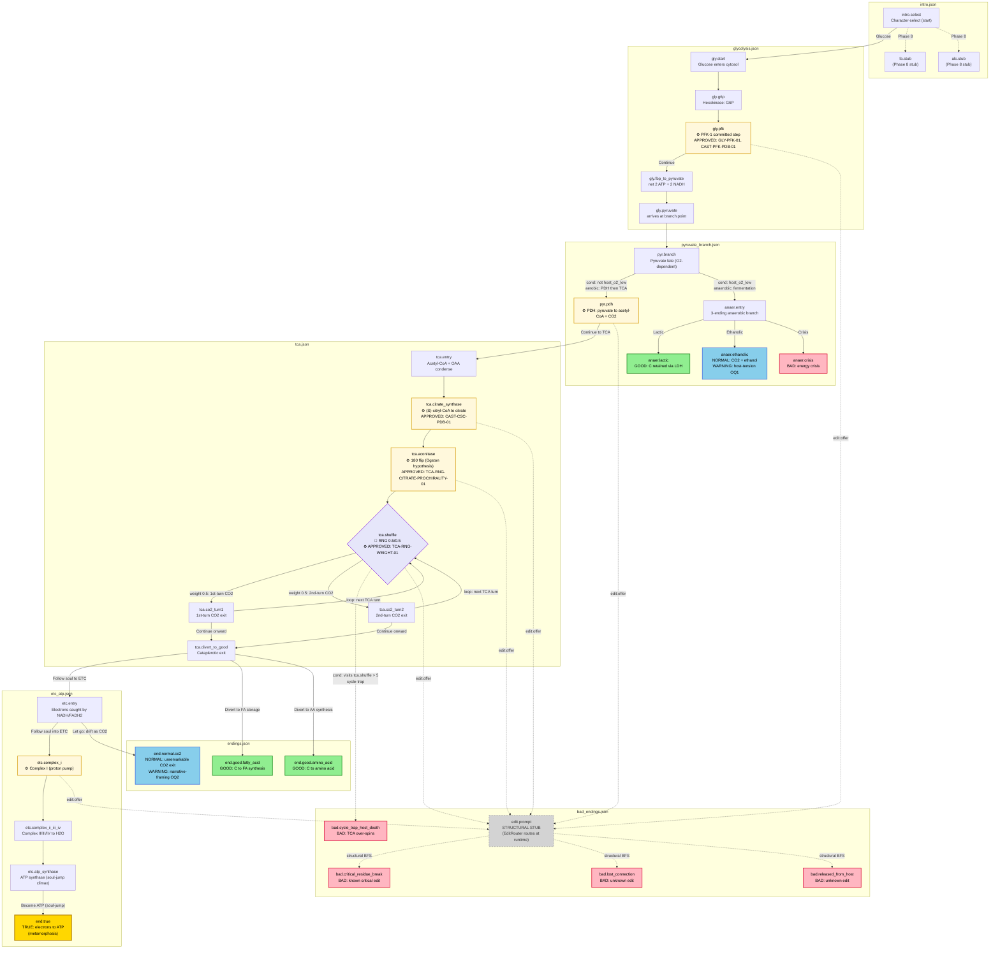

# Phase 5.1 — Glucose Story Graph Diagram

A visual summary of the 34-node glucose skeleton (`data/story_glucose/`) for human
review (Plan 05.1-06). Color-coded by ending tier; edit-allowed nodes marked with
a gear icon; the RNG shuffle is a diamond; structural (non-runtime) edges are dashed.

**Legend:**

| Style | Meaning |
|-------|---------|
| Solid arrow `-->` | Player-traversed `choice.goto` edge (BFS-reachable) |
| Dashed arrow `-.->` | Structural-only edge (BFS-reachable, not player-facing at runtime) |
| Gold rounded box | True ending |
| Green rounded box | Good ending |
| Blue rounded box | Normal ending |
| Red rounded box | Bad ending |
| Cream box with ⚙️ | Edit-allowed node (`edit:enzyme:<id>` tag — player can trigger an edit) |
| Purple diamond with 🎲 | RNG-shuffle node (weighted choice — the RNG decides, not the player) |
| Grey dashed box | Structural stub (`edit.prompt` — runtime routing bypasses it) |

---

## Full Graph Topology

---

## Branch-Point Mapping (SC1 human-review)

Each real player-facing branch point in the graph, the pathway fact it maps to, and
the claim status. **No invented branches** — every branch traces to spec.md, an
approved source, or a flagged `PLACEHOLDER_PHASE7` node (Phase 7 fills citations).

| # | Branch node | Player options | Pathway branch point mapped to | Claim status |
|---|-------------|----------------|-------------------------------|--------------|
| 1 | `intro.select` | Glucose / FA / Alcohol | Character selection (spec.md L19 — meta-game, not a pathway branch) | PLACEHOLDER_PHASE7 |
| 2 | `pyr.branch` | Aerobic (PDH→TCA) / Anaerobic (fermentation) | **Pyruvate fate depends on O2** — aerobic: pyruvate→acetyl-CoA via PDH; anaerobic: pyruvate→lactate/ethanol (spec.md L14, option d) | PLACEHOLDER_PHASE7_ANAEROBIC |
| 3 | `anaer.entry` | Lactic / Ethanolic / Crisis | **3-ending anaerobic branch** — lactic=Good (C retained via LDH), ethanolic=Normal (CO2), crisis=Bad (energy failure) (PROJECT.md row 97) | PLACEHOLDER_PHASE7_ANAEROBIC |
| 4 | `tca.shuffle` | 1st-turn CO2 (w=0.5) / 2nd-turn CO2 (w=0.5) / edit / cycle-trap | **Citrate prochirality RNG shuffle** — the Ogston hypothesis: aconitase discriminates citrate's two carboxymethyl groups (spec.md L13) | **APPROVED: TCA-RNG-WEIGHT-01, TCA-RNG-CITRATE-PROCHIRALITY-01** |
| 5 | `tca.divert_to_good` | Follow soul (ETC) / FA storage / AA synthesis | **Cataplerotic exit** — citrate→cytosol→FA synthesis; OAA→aspartate; aKG→glutamate (carbon diverted pre-oxidation = Good) | PLACEHOLDER_PHASE7_TCA |
| 6 | `etc.entry` | Follow soul (ETC) / Let go (CO2) | **ETC entry vs CO2 exit** — the narrative "let go" branch point (Normal-ending tier) | PLACEHOLDER_PHASE7_ETC |
| 7 | `edit.prompt` (stub) | critical-residue / unknown-A / unknown-B | *(structural stub — NOT a real pathway branch; the EditRouter owns the real edit routing)* | PLACEHOLDER_PHASE7_EDIT |

---

## Ending-Tier Distribution (11 endings)

| Tier | Count | Nodes |
|------|-------|-------|
| True | 1 | `end.true` (electrons→ATP via ETC, metamorphosis) |
| Good | 3 | `anaer.lactic`, `end.good.fatty_acid`, `end.good.amino_acid` |
| Normal | 2 | `anaer.ethanolic`, `end.normal.co2` |
| Bad | 5 | `anaer.crisis`, `bad.lost_connection`, `bad.released_from_host`, `bad.cycle_trap_host_death`, `bad.critical_residue_break` |

Matches PROJECT.md row 107 (user-confirmed asymmetric distribution).

---

## Edit-Allowed Nodes (SC4 — 5 nodes + the shuffle)

Each carries an `edit:enzyme:<id>` tag binding it to an EditRouter lookup bucket.
The player's edit generates an `EditIntent`; `EditRouter.route(intent, enzyme_id)`
returns a node-id (known→branch node, unknown→bad-ending pool).

| Node | enzyme_id | Real enzyme + PDB | Claim status |
|------|-----------|-------------------|--------------|
| `gly.pfk` | `gly.pfk` | PFK-1; PDB 4PFK | **APPROVED: GLY-PFK-01, CAST-PFK-PDB-01** |
| `pyr.pdh` | `pyr.pdh` | PDH complex; PDB TBD (Phase 9) | PLACEHOLDER_PHASE7 |
| `tca.citrate_synthase` | `tca.citrate_synthase` | Citrate synthase; PDB 1CSC | **APPROVED: CAST-CSC-PDB-01, TCA-RNG-CITRATE-PROCHIRALITY-01** |
| `tca.aconitase` | `tca.aconitase` | Aconitase; PDB TBD (Phase 9) | **APPROVED: TCA-RNG-CITRATE-PROCHIRALITY-01** |
| `tca.shuffle` | `tca.aconitase` | Aconitase (same bucket — the shuffle's edit:offer edits aconitase) | **APPROVED: TCA-RNG-WEIGHT-01, TCA-RNG-CITRATE-PROCHIRALITY-01** |
| `etc.complex_i` | `etc.complex_i` | Complex I; PDB 5LDW (candidate) | PLACEHOLDER_PHASE7_ETC |

---

## Key Design Decisions Locked (do not re-litigate)

- **Soul-jump True ending** (metamorphosis): hero's electrons→ATP via ETC; carbon body shed as CO2. NOT "carbon becomes ATP."
- **C14-decay DROPPED**: `bad.cycle_trap_host_death` is the SOLE timescale bad-ending (no radioactive decay).
- **Anaerobic = option (d)**: glucose gets 3-ending branch; FA/alcohol get Bad-trigger only. Host = mammal.
- **TCA RNG 0.5/0.5**: approved weights for 1st-turn vs 2nd-turn CO2 exit.
- **Edit routing**: lookup table + bad-ending fallback (no chemistry-correctness engine).
